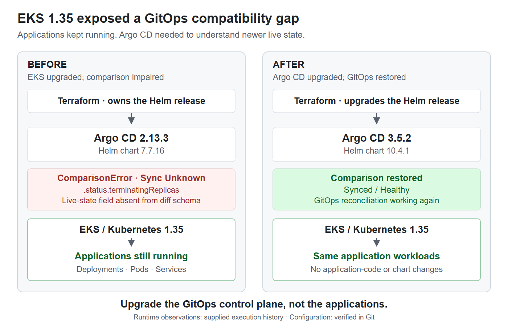

# EKS 1.35 Exposed an Argo CD Compatibility Gap

> Upgrading the GitOps control plane without changing application workloads



## Context

The EKS upgrade did not break the applications. In this platform, it exposed that the existing Argo CD version could no longer correctly interpret part of the newer Kubernetes live-state schema.

The ownership chain was **Terraform → Argo CD Helm release → Argo CD → GitOps desired state → Kubernetes workloads**. Terraform owned the Argo CD installation and version. The GitOps repository held Applications, AppProjects, Helm values and YAML; Argo CD reconciled them. Kubernetes kept the already-created workloads running.

**Evidence boundary:** local Git history confirms the chart change, Terraform ownership and retained configuration. Runtime versions, the incident sequence and recovery observations below come from supplied project execution history; this review did not access the live cluster or recover its original error logs.

## What Changed

EKS / Kubernetes was upgraded to **1.35 first**. The Argo CD upgrade followed the comparison failure.

| Component | After the EKS upgrade | After the fix |
|---|---|---|
| EKS / Kubernetes | 1.35 | 1.35 |
| Argo CD runtime | 2.13.3 | 3.5.2 |
| Argo CD Helm chart | 7.7.16 | 10.4.1 |
| Application code and charts | Existing versions | Unchanged for this fix |

Platform commit `5385fe4` records the chart change. The values template also documents chart `7.7.16` with appVersion `v2.13.3`; the installed runtime versions, including target `3.5.2`, remain supplied execution history.

## Symptom

Existing application workloads continued running, but affected Argo CD Applications reported **`ComparisonError`** and **sync status `Unknown`**.

The reported failure occurred during structured/typed diff of live Deployment state: Argo CD could not interpret `.status.terminatingReplicas` because that field was absent from its comparison schema. This describes the supplied error's meaning, not a recovered verbatim log line.

## Root Cause

The incompatible layer was **Argo CD comparing newer Kubernetes API state**. The field belonged to Deployment status reported by Kubernetes, rather than the application's desired Deployment template. Kubernetes documents this [terminating-replica status field](https://kubernetes.io/docs/concepts/workloads/controllers/deployment/#terminating-pods); Argo CD documents how its built-in schemas can cause [field-not-declared comparison errors](https://argo-cd.readthedocs.io/en/release-3.2/faq/#how-do-i-fix-field-not-declared-in-schema).

This was the behavior observed in this platform, not a claim that every Kubernetes 1.35 cluster with older Argo CD fails identically.

## Why the Applications Did Not Need to Change

Editing application YAML would have targeted the wrong layer: it would not update Argo CD's understanding of live Kubernetes state.

Kubernetes controllers continued maintaining existing Deployments, Pods and Services while Argo CD's comparison was impaired. Upgrading Argo CD could temporarily interrupt GitOps reconciliation without inherently requiring new application images, chart rewrites or database migrations.

The main migration risk was **reconciliation behavior after the upgrade**: the new Argo CD could interpret or apply desired state differently. Independent control-plane upgrades still required workload validation.

## Upgrade Through Terraform

Terraform's `helm_release.argocd` used `var.chart_version`, wired from the platform's `argocd_chart_version`. The fix therefore belonged in the infrastructure repository through the existing Helm release.

The supplied execution sequence was:

1. Identify the comparison incompatibility and select the Argo CD/chart target.
2. Review chart/default changes and preserve required platform settings.
3. Review `terraform plan`, then upgrade the existing Argo CD release through Terraform.
4. Validate GitOps recovery and application runtime health separately.

The repository proves the configuration change, not the exact historical plan output. No resource-change counts are claimed.

## Preserving Platform Behavior

The chart upgrade explicitly retained the previous networking behavior:

```yaml
global:
  networkPolicy:
    create: false
```

This avoided introducing chart-generated NetworkPolicies implicitly during the upgrade; it was a configuration consideration, not the schema-error cause.

The existing `configs.cm` key `resource.customizations.health.argoproj.io_Application` was also retained. Its Lua check starts at `Progressing`, then propagates the child Application's health status and message when present, supporting App-of-Apps health gating. A new chart version was not a reason to discard intentional platform behavior.

## Validation

The supplied execution history reports two separate outcomes:

| Level | Recovery observation |
|---|---|
| Argo CD / GitOps | Components healthy; the affected comparison error cleared, sync no longer `Unknown`, comparison and reconciliation restored, and App-of-Apps health behavior preserved. |
| Application runtime | Existing Deployments remained available, Pods healthy and Services reachable; this fix required no application rebuild or redeployment. |

These are historical observations, not fresh checks. Local review independently confirmed the retained health configuration; no archived validation count was found or is claimed.

## Result

Upgrading the Terraform-managed Argo CD control plane restored GitOps comparison and reconciliation on EKS 1.35. Application code and application charts did not need to change.

## Key Lessons

- **Healthy workloads ≠ a healthy GitOps control plane.**
- A Kubernetes upgrade can expose compatibility gaps in platform tooling while applications keep running.
- Fix the layer that owns the problem: Terraform upgraded Argo CD; application repositories did not need to change.
