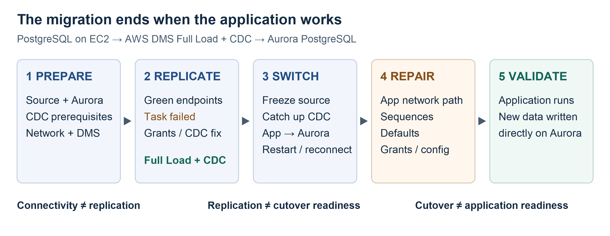
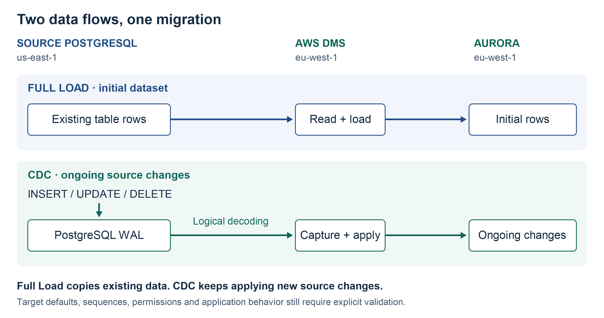

# From Green DMS Endpoints to a Working Application

> PostgreSQL to Aurora Full Load, CDC and Application Cutover

Green endpoints were only the first checkpoint. The lab then encountered a DMS task failure, recovered replication, performed a real application cutover and repaired the target path and database behavior before the application could run successfully.

**Connectivity working ≠ replication working** 
**Replication working ≠ cutover ready** 
**Cutover completed ≠ application ready**

**Prepare → Replicate → Switch → Repair → Validate**

## Context

The source was PostgreSQL 15 on EC2 in `us-east-1`, serving a small application using `appdb` and schema `app`. AWS DMS and private Aurora PostgreSQL 17.7 ran in `eu-west-1`. DMS read the source across VPC peering and applied changes locally to Aurora. [Environment preparation is documented separately](../postgresql-aurora-migration-environment/README.md).

**Evidence boundary:** runtime events and counters below come from the recorded lab execution history, including the cutover on **31 March 2026**. A separate static review was used to cross-check architecture and readiness findings, but it did not execute Terraform, scenario scripts or AWS operations. Runtime success is therefore based on the lab execution history rather than the static review.

## How AWS DMS Full Load + CDC Works

**Full Load** reads existing rows from selected source tables and loads them into the target. **Change Data Capture (CDC)** captures ongoing logical changes from PostgreSQL WAL and applies them while the source application continues running. The existing dataset is not reconstructed entirely from WAL.

During Full Load, DMS caches changes to tables being loaded and applies them after each table's load completes, then continues ongoing replication. [AWS DMS migration phases](https://docs.aws.amazon.com/dms/latest/userguide/CHAP_Introduction.HighLevelView.html)

This task used `full-load-and-cdc`, selecting `app.%`. The snapshot configured `test_decoding`, heartbeat and logging. These settings described the intended replication behavior; task statistics and target observations were needed to establish that it worked.

## 1. Prepare

Preparation covered source bootstrap and seed data, logical replication prerequisites, Aurora schema/access, cross-region routes and Security Groups, and DMS endpoints. A helper EC2 with SSM and `psql` provided private target administration.

Two configuration choices later mattered: `DROP_AND_CREATE` allowed DMS to recreate target tables, making post-load metadata inspection essential; Limited LOB mode set a **32 KB** limit for LOB values, requiring separate size and correctness checks for `TEXT`, `JSONB` and `BYTEA` columns. No observed truncation is claimed in this lab. [AWS DMS LOB handling](https://docs.aws.amazon.com/dms/latest/userguide/CHAP_Tasks.LOBSupport.html)

## 2. Replicate

### Endpoint Tests Passed; the Task Failed

Both endpoint tests succeeded. The migration task then failed with **`Stream Component Fatal error`**.

Troubleshooting followed the layers the endpoint tests had not established: effective WAL settings, listener and `pg_hba.conf`, DMS source CIDRs, `replication_user`, schema/table/sequence privileges and source-side DMS internal requirements. The missing or incorrect DMS CloudWatch logging role also had to be addressed so task behavior could be diagnosed.

The strongest static-review hypothesis was a mismatch between the initial least-privilege grants and DMS's DDL/heartbeat requirements. The review found heartbeat enabled in `public`, while helper defaults and endpoint behavior were not aligned. The scenario referenced artifacts such as `awsdms_ddl_audit` and `awsdms_intercept_ddl`; this does not establish that every artifact was observed in every runtime attempt. AWS documents the endpoint's DDL and heartbeat controls separately. [PostgreSQL endpoint settings](https://docs.aws.amazon.com/dms/latest/APIReference/API_PostgreSQLSettings.html)

Broader permissions were temporarily introduced as a diagnostic step to isolate the privilege-related failure. This was not a recommendation to retain unrestricted application or migration access. The final supported privilege model still required deliberate hardening; neither an exact first causal error nor a completed privilege reduction is independently established by the static snapshot.

### Full Load and CDC Succeeded

After source permission/configuration corrections, the task reached a successful running state:

| Historical runtime observation | Result |
|---|---|
| Full Load | `100%` |
| Application tables loaded | `6` |
| `TablesErrored` | `0` |
| Example `orders` counters | Approximately 2,985 loaded rows, 135 CDC inserts and 180 CDC updates |
| Example `order_items` counters | Approximately 6,059 loaded rows and 271 CDC inserts |

Later Aurora checks showed row growth while CDC was active. Together, these observations established that the existing dataset had loaded and new source-side changes were arriving on Aurora. They did not establish full schema equivalence, a throughput benchmark or application readiness.

## 3. Switch

The real application cutover took place on 31 March 2026. One recorded source-application stop point was approximately **11:14:48 UTC**.

The cutover sequence was to stop/fence source application writes, allow CDC to catch up, check the target, point the application at the Aurora writer, and restart/reconnect it. The supplied history does not include a complete timestamped catch-up or end-of-outage evidence series.

The generator read database configuration at startup and maintained its own connection loop. Changing an environment variable outside the running process did not retarget its existing connections. The switch therefore required a restart with the target connection settings and suitable application identity.

## 4. Repair

### Application → Aurora Networking

The first cutover problem was the application's own route to Aurora. DMS → source, DMS → Aurora and helper → Aurora connectivity had already worked; those paths did not prove source application EC2 → Aurora access.

Repair addressed the cross-region application-to-target path across peering, routes, Security Groups and TCP/5432. The supplied history does not isolate one exact rule as the sole cause. Once the application could reach Aurora, it exposed a second class of failure.

### Defaults, Sequences and Access

Replicated rows were present, but target behavior still differed from what the application expected. The observed issues included `orders` timestamp/default behavior, `order_items.id` sequence/default behavior, grants and Aurora-side configuration.

The sequence repair followed this pattern:

**Discover/create sequence → attach column default → establish ownership → reconcile sequence state → retest inserts**

DMS can copy explicit row IDs without advancing the target sequence to a safe next value. A later application insert that relies on the default can therefore produce an already-used ID. Row replication and generated-ID behavior are separate migration concerns. [AWS PostgreSQL target limitations](https://docs.aws.amazon.com/dms/latest/userguide/CHAP_Target.PostgreSQL.html)

Reconciliation cannot safely be reduced to a universal `max(id)` recipe. It must account for source and target state, `last_value`, `is_called`, increments, cache and already allocated values. Deleted rows and failed transactions can leave gaps; sequence state is not a row count. Perform the reconciliation with writers controlled, then test the actual insert behavior. [PostgreSQL sequence semantics](https://www.postgresql.org/docs/17/functions-sequence.html)

The supplied history establishes the repair mechanism; exact SQL and live sequence names remain unverified.

## 5. Validate

After the network and target-database repairs, the mini application ran against the **Aurora writer** and created new post-cutover data there.

| Captured target comparison | Before → after |
|---|---|
| `orders` rows | 4,363 → 4,381 |
| `order_items` rows | 8,807 → 8,812 |

These are supplied historical observations, not a new verification run. The decisive result combined the application being connected to Aurora with successful new application-generated writes. `DMS task = RUNNING` and row counts alone would not have established that result.

## Why DMS Success Was Not Enough

Previous Oracle Data Pump experience supplied a useful comparison: its export/import workflow can carry data plus substantial object metadata, subject to export scope and limitations. [Oracle Data Pump Export](https://docs.oracle.com/en/database/oracle/oracle-database/19/sutil/oracle-data-pump-export-utility.html)

This DMS replication-instance task primarily moved table data and ongoing changes. DMS could create target tables, but that did not establish complete schema and application equivalence.

In this lab, `DROP_AND_CREATE` and namespace-only target preparation made that distinction concrete. The application needed working defaults, sequences and permissions after the rows arrived. The broader metadata inventory below is a production-readiness checklist; not every item caused an observed lab failure.

## What I Would Change for a Larger Production Database

| Area | Required preparation or acceptance evidence |
|---|---|
| Schema and metadata | Inventory tables/types, sequences/defaults, PK/unique/check/FK constraints, indexes, extensions, views/materialized views, functions/triggers, ownership, users and grants. Deliberately plan pre/post-load DDL and a compatible target preparation mode; compare actual schema drift after loading. |
| Every real network path | Test DMS → source, DMS → target, administration → target, application → target, and monitoring/operational access. Verify all relevant subnet routes and return paths, including potential failover placement. |
| Full Load benchmark | Measure table throughput, large-table duration, target write capacity and DMS CPU/memory/storage. Benchmark the configured eight subtasks and `CommitRate=50000`; these are settings, not measured performance. |
| CDC and WAL | Measure source/target CDC latency, sustained write rate, long transactions, slot health and source WAL growth. Budget retention and recovery headroom for outages. |
| LOB correctness | Profile real `TEXT`/`JSONB`/`BYTEA` sizes and compare representative large values. Choose and test a LOB strategy instead of assuming the current 32 KB cap is sufficient. |
| Cutover gates | Fence source writes and drain transactions; prove CDC convergence, zero errored/suspended tables and passed data comparisons. Stop replication before final sequence reconciliation and target application writes. Require metadata, application connectivity/identity/grants and a clear rollback decision point. |
| Business smoke tests | Exercise customer/product reads, order and order-item inserts, status updates, generated IDs, timestamps/defaults, uniqueness/FK/check behavior and representative queries. Use the application role, not only an administrator login. |

### RPO/RTO Rehearsal and Rollback

The lab defined **RPO ≤1 minute** and **RTO ≤15 minutes** as migration objectives. They remain rehearsal acceptance criteria rather than claimed production SLA results. The small dataset and troubleshooting after the first switch do not establish either target; the recorded stop time alone cannot establish an achieved RTO.

A representative rehearsal needs measured CDC latency under load, a timed write freeze, final catch-up, application restart and mandatory smoke tests. Define the end of RTO as restored, validated application service and record that timestamp.

Replication was one-way, source → target. Before target-only writes, returning to a still-authoritative source can be simpler. Once Aurora accepts new writes, changing the connection string back risks losing those changes. Fence writes and choose reconciliation, a controlled reverse migration/sync, or forward repair. No tested reverse-replication design is claimed.

### Production-Hardening Follow-Up

- Replace copied endpoint credentials with a supported live secret binding and verify transport security.
- Reconcile source CDC/DDL/heartbeat privileges with the actual supported DMS configuration.
- Align helper-script region defaults with `eu-west-1`; verify CloudWatch log delivery before troubleshooting.
- Expand route discovery beyond the first sampled private subnet and complete target identity/metadata preparation.

These findings describe follow-up work for a stronger production design; they are not claims about the final live security posture of this lab.

## Result and Key Lessons

The small-dataset lab finished with the mini application connected to the Aurora writer and creating new post-cutover data. Migration success had to be validated at four separate layers: network connectivity, replication, target database semantics and actual application behavior.

The memorable sequence is **Prepare → Replicate → Switch → Repair → Validate**. For a larger migration, the repairs discovered here should become preparation checks and rehearsed cutover gates.
