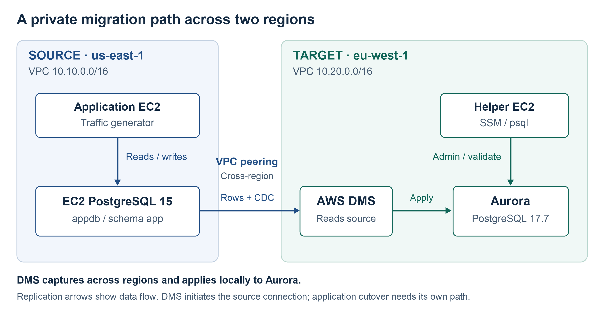

# Building a Cross-Region PostgreSQL to Aurora Migration Environment

> Preparing source PostgreSQL, Aurora, networking and AWS DMS before migration execution.

## Context

The lab modeled the migration of a running PostgreSQL-backed mini application from EC2 in `us-east-1` to Amazon Aurora PostgreSQL in `eu-west-1`. Preparation covered database bootstrap, logical replication, private networking, target administration and migration privileges.

The dataset was intentionally small. The goal was to exercise the migration path and expose readiness gaps, rather than demonstrate large-database throughput.

**Source → Bootstrap → CDC → Network → Target → DMS → Privileges → Validate**

## Architecture Decision

| Component | Placement | Purpose |
|---|---|---|
| Application / traffic generator | Source VPC `10.10.0.0/16`, `us-east-1` | Produce reads, inserts and updates against the source |
| PostgreSQL 15 on EC2 | Source VPC | Host `appdb`, application schema `app` |
| AWS DMS replication instance | Target VPC `10.20.0.0/16`, `eu-west-1` | Read the source across peering; apply changes locally to Aurora |
| Aurora PostgreSQL 17.7 | Target VPC, private access | Receive migrated data and become the application's database |
| Helper EC2 with SSM and `psql` | Target VPC | Provide a controlled SQL administration and validation path |

DMS ran in the **target region**, keeping target writes local to Aurora while source reads crossed the regional boundary. The lab exercised this topology without benchmarking alternative placements.

Terraform described three areas: source, target, and peering/DMS. SQL bootstrap and the application generator supplied the database behavior that infrastructure alone could not establish.

## Source Bootstrap and CDC Preparation

The source bootstrap prepared PostgreSQL, users, schema and seed data. Six base tables represented a small commerce application: `customers`, `products`, `categories`, `orders`, `order_items` and `audit_log`.

The source DDL defined UUID and serial/bigserial-backed IDs, timestamp defaults, primary/unique/check/foreign-key constraints, secondary indexes, extensions, a view and a materialized view. These were dependencies to inventory and validate separately from replicated rows.

The generator performed reads, inserts and updates while the migration ran. This made CDC observable against changing source data.

CDC preparation required checking several independent layers:

- Effective logical WAL configuration, available replication slots/senders and the configured `test_decoding` plugin.
- PostgreSQL listener settings and ordered `pg_hba.conf` rules accepting the actual target-region DMS connection.
- Database `CONNECT`, schema `USAGE`, table/column `SELECT`, relevant sequence access and replication capabilities.
- Additional capabilities needed by DMS DDL capture, heartbeat and internal objects.

A configuration file or a checking script was not proof that the live setting had taken effect. In particular, the snapshot's `setup-wal.sql` inspected settings; it did not itself enable logical WAL.

**A successful endpoint test established connectivity and authentication, not Full Load and CDC readiness.** The execution case study shows why that distinction mattered.

## Private Cross-Region Networking

The two non-overlapping VPCs were joined through cross-region peering, with requester/accepter configuration and routes in both directions. Reachability also depended on participating private-subnet route tables, Security Group ingress and egress, and TCP/5432 access.

| Path | What it needed to prove |
|---|---|
| DMS → source PostgreSQL | Cross-region capture path, return routing and source authentication |
| DMS → Aurora | Local target apply path and migration-user access |
| Helper EC2 → Aurora | Private administration and validation access |
| Source application EC2 → Aurora | The application's own cross-region path and target identity at cutover |

The first three paths could work while the fourth remained unusable. The real cutover later exposed this gap. An endpoint check from DMS could not substitute for an application-host test.

## Aurora Preparation and the Helper EC2

The target configuration requested Aurora PostgreSQL `17.7`, parameter-family major `17`, and one instance. A single-instance lab was not a demonstration of application failover readiness.

The helper EC2 provided SSM access and a `psql` client inside the target network. It supported target bootstrap, schema inspection, connectivity checks, post-load validation, troubleshooting and later repair. Aurora's managed administration model made this private SQL access path useful; there was no Aurora host to administer like the source EC2.

Target access depended on VPC routes, Security Groups, credentials/roles, database/schema privileges and Aurora parameter configuration. Aurora did not expose an ordinary editable `pg_hba.conf`.

The preparation helper created the `app` schema namespace and grants. That was not complete metadata parity. The snapshot also contained `force_ssl=false` as an input; it did not establish the effective live parameter or negotiated connection security.

## Users, Privileges and Readiness

The source distinguished `app_user`, `analytics_user` and `replication_user`. The target inputs used `appuser`, so application identity mapping and grants needed explicit validation. Updating only a hostname could not establish that the application's target role was usable.

The initial minimal source grants did not cover the complete lab scenario. Production hardening must reconcile intended DDL/heartbeat behavior with the supported privilege model for the actual DMS build. AWS documents superuser requirements for self-managed PostgreSQL CDC; a login with replication and read grants should not be presented as a universally sufficient substitute. [AWS PostgreSQL source prerequisites](https://docs.aws.amazon.com/dms/latest/userguide/CHAP_Source.PostgreSQL.html)

The useful readiness sequence was to verify source bootstrap and effective CDC settings, test each real network path, prepare the target and identities, then exercise DMS against ongoing writes. Schema and application checks still had to follow the load.

## Result and Key Lessons

The environment supported the subsequent Full Load, CDC and application-cutover exercise. That execution also revealed gaps the initial preparation had missed.

- A successful DMS migration starts well before the task itself.
- Network readiness belongs to each client path, including the application.
- A schema namespace and replicated rows do not establish application-ready database behavior.
- Region defaults, effective settings and actual privileges need verification, even when Terraform intent is clear.

## Evidence and Scope

Architecture and readiness findings were cross-checked against the scenario snapshot and a separate static review. That review did not run Terraform or scenario scripts, use AWS credentials, or inspect live AWS resources.

Statements about the running generator and subsequent migration outcome come from the recorded lab execution history. Runtime success is therefore presented separately from the static architecture and readiness review.

Continue with [AWS DMS execution and application cutover](../postgresql-aurora-dms-cutover/README.md).
